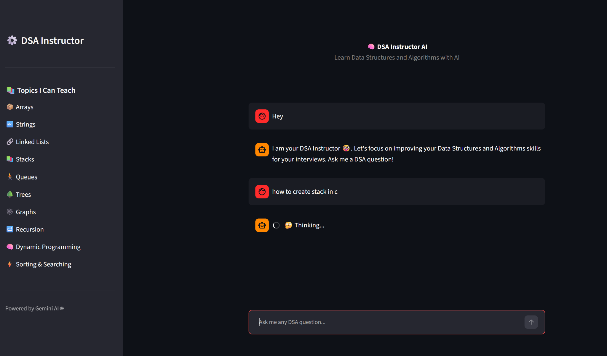
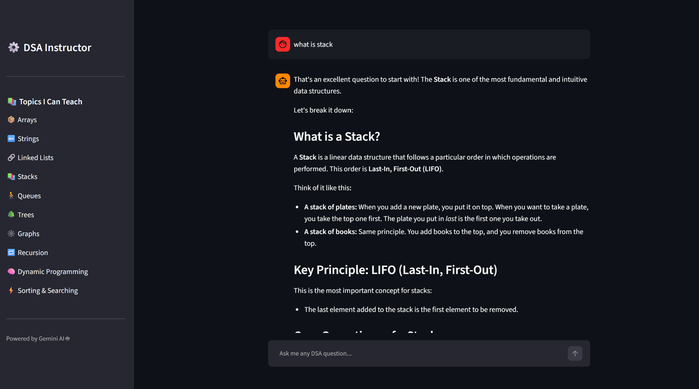

# 🧠 DSA Instructor AI

An AI-powered **Data Structures and Algorithms (DSA) instructor** that helps you learn DSA concepts in a simple, interview-focused way.

Ask a DSA question, choose a topic from the sidebar, and get an explanation from an AI instructor powered by **Google Gemini**.

🌐 **Live Demo:** https://dsa-instructor-ai-32fo.onrender.com/

💻 **GitHub:** https://github.com/numanAnsari0301/DSA-Instructor-AI

---

## ✨ Features

- 🤖 **Interactive AI Instructor** — Ask questions and get explanations in a conversational format.
- 📚 **DSA-Focused Learning** — Covers important topics such as Arrays, Strings, Linked Lists, Stacks, Queues, Trees, Graphs, Recursion, Dynamic Programming, and Sorting & Searching.
- 💡 **Interview Preparation** — Get clear explanations designed to help build DSA fundamentals for technical interviews.
- 🧭 **Topic-Based Navigation** — Quickly choose a DSA topic from the sidebar.
- 🌙 **Clean Dark UI** — Simple interface designed for comfortable learning.
- ⚡ **Gemini-Powered Responses** — Uses Google's Gemini AI to generate explanations and examples.

---

## 🖥️ Screenshots

### Home / Instructor Interface



### Asking a DSA Question


### AI Response



---

## 🛠️ Tech Stack

- **Python**
- **Streamlit**
- **Google Gemini API**
- **python-dotenv**
- **Render** for deployment

---

## 📚 Topics Covered

- Arrays
- Strings
- Linked Lists
- Stacks
- Queues
- Trees
- Graphs
- Recursion
- Dynamic Programming
- Sorting & Searching

---

## 🚀 Run Locally

### 1. Clone the repository

```bash
git clone https://github.com/numanAnsari0301/DSA-Instructor-AI.git
cd DSA-Instructor-AI
```

### 2. Create a virtual environment

```bash
python -m venv venv
```

Activate it:

**Windows**
```bash
venv\Scripts\activate
```

**Linux / macOS**
```bash
source venv/bin/activate
```

### 3. Install dependencies

```bash
pip install -r requirements.txt
```

### 4. Add your Gemini API key

Create a `.env` file in the project root:

```env
GEMINI_API_KEY=your_api_key_here
```

> Keep your API key private and do not commit your `.env` file to GitHub.

### 5. Run the application

```bash
streamlit run dsa.py
```

The application will be available locally at the Streamlit URL shown in your terminal.

---

## ☁️ Deployment on Render

This project can be deployed as a Python web service on Render.

**Build Command:**

```bash
pip install -r requirements.txt
```

**Start Command:**

```bash
streamlit run dsa.py --server.port $PORT --server.address 0.0.0.0
```

Add the following environment variable in Render:

```text
GEMINI_API_KEY=your_api_key_here
```

---

## 🎯 Project Goal

The goal of this project is to make DSA learning more interactive by providing an AI instructor that students can use to understand concepts, ask questions, and prepare for technical interviews.

---

## 👨‍💻 Author

**Numan Ansari**

B.Tech — Information Technology

Rajkiya Engineering College, Bijnor

---

⭐ If you find this project useful, consider giving the repository a star!
